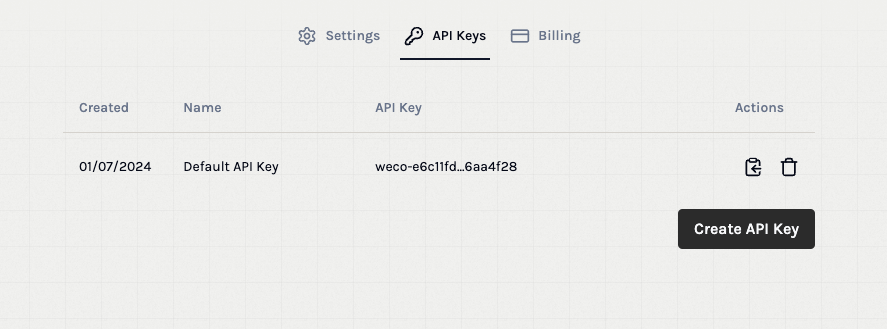

# Introduction

## Why use [`weco`](../index.md)?

## Jump In

### Export API Key

When using the Weco API, you will need to set the API key. You can find/setup your API key [here](https://www.aifunction.com/account/api-keys). Here's what it looks like.



Once you have your API key, pass it directly to the client using the `api_key` argument or set it as an environment variable as below.
```bash
export WECO_API_KEY=<YOUR_WECO_API_KEY>
```

### Build & Deploy

We can create a function on the [web console](https://www.aifunction.com) for the following task:
> "Analyze a business idea and provide a structured evaluation. Output a JSON with 'viability_score' (0-100), 'strengths' (list), 'weaknesses' (list), and 'next_steps' (list)."

Or just stick to using Python:
```python
from weco import build
fn_name, version_number, fn_description = build(
    task_description="Analyze a business idea and provide a structured evaluation. Output a JSON with 'viability_score' (0-100), 'strengths' (list), 'weaknesses' (list), and 'next_steps' (list).",
)
print(f"Function {fn_name}/{version_number} does the following:\n{fn_description}")
```

Here's how you can query this function anywhere in your code!
```python
response = query(
    fn_name="BusinessIdeaAnalyzer-XYZ123",  # Replace with your actual function name
    text_input="A subscription service for personalized, AI-generated bedtime stories for children."
)
```
For more examples and an advanced user guide, check out our function builder [cookbook](../cookbook/cookbook.md) and [API reference](../api/api.md)

Happy building $f$(👷‍♂️)!
